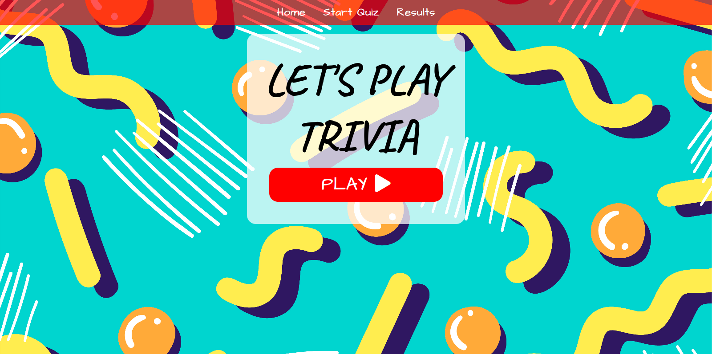
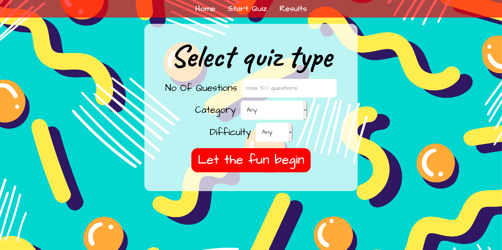
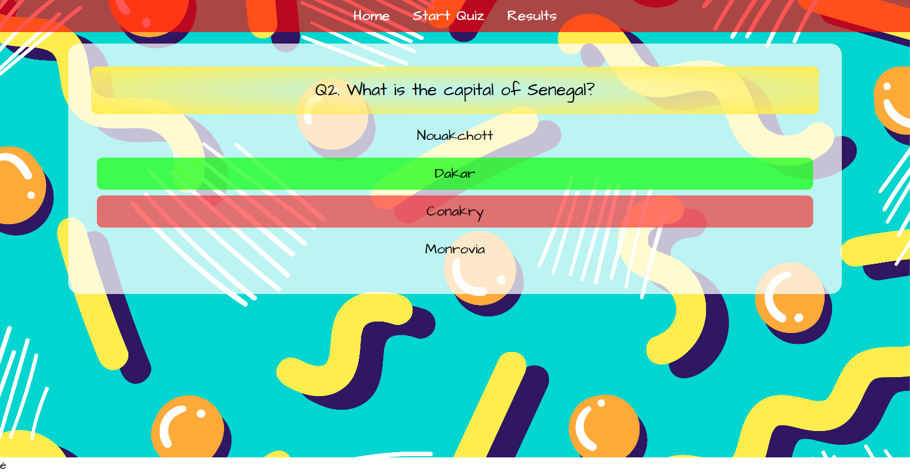
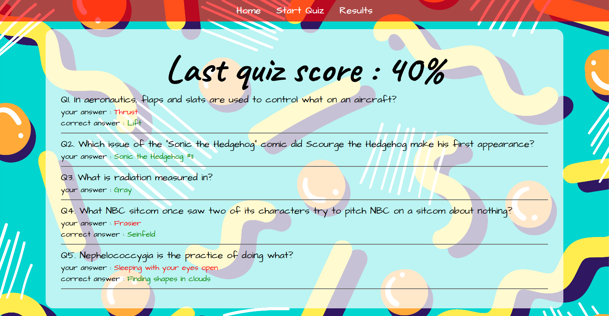

# Trivia Game

> Trivia game utilizing opentdb.com API

## Live Demo

[Live Demo Link](https://keshavmahawar.github.io/TriviaGame/index.html)

## Screen shots

## Built With

-   HTML
-   CSS
-   JS

## Getting Started

**Just fork it and fell free to use it.**

Get a local copy on the and open the index.html file in the browser

## Acknowledgments

-   API request is handled by using XHR requests
-   Quiz controller is built using js closures and maintain the current question state.
-   Questions fetched from API and results are stored in local storage

## Author

👤 **Keshav Mahawar**

-   Github: [@KeshavMahawar](https://github.com/KeshavMahawar)
-   Twitter: [@kesmahawar](https://twitter.com/kesmahawar)
-   Linkedin: [Keshav Mahawar](https://www.linkedin.com/in/keshav-m-191a8b131)

## 🤝 Contributing

Contributions, issues and feature requests are welcome!

Feel free to check the [issues page](https://github.com/arjun1237/Chitrakala/issues).

## Show your support

Give a ⭐️ if you like this project!

## 📝 License

This project is [MIT](./LICENSE) licensed.
